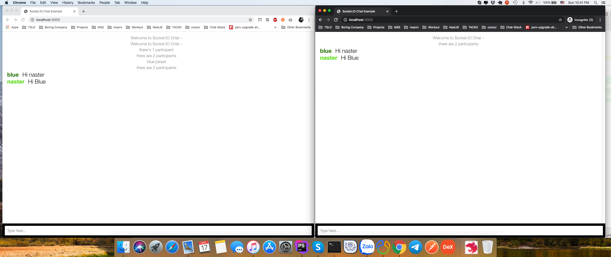

# System requirement
[Redis](https://redis.io/)
[Nest](https://nestjs.com/)
[Socket.io](https://socket.io/)

## Installation

```bash
$ npm install
```

## Running the app

```bash
# development
$ npm run start

# watch mode
$ npm run start:dev

# production mode
$ npm run start:prod
```


* Navigate to http://localhost:3000/ !

